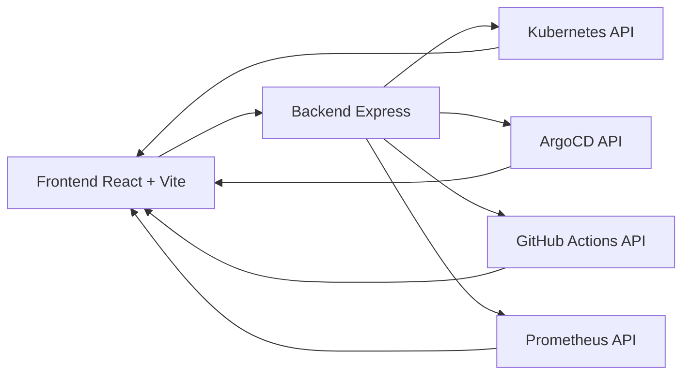

# app-luisops

Dashboard operativo para observabilidad de un cluster Kubernetes montado con kubeadm.

Este proyecto muestra el estado real de la plataforma luisops: salud del cluster, estado GitOps con ArgoCD, actividad CI/CD en GitHub Actions y métricas RED/SLO desde Prometheus.

## Objetivo del proyecto

app-luisops no es solo una web informativa; es una consola ligera de operación para:

- Ver el estado de nodos y consumo CPU/RAM por nodo.
- Validar sincronización y health de aplicaciones desplegadas por ArgoCD.
- Seguir los últimos runs de pipelines CI/CD.
- Consultar métricas de performance y fiabilidad (RED + SLO).
- Mostrar la arquitectura end-to-end del entorno (infra, flujo de despliegue y observabilidad).

## Estado actual

Actualmente la aplicación está enfocada en monitorizar un entorno kubeadm con separación por dominios:

- Cluster health (nodes/pods/namespaces/uptime).
- GitOps health (sync + health status por aplicación).
- CI/CD visibility (últimos 10 runs desde GitHub Actions).
- Observabilidad funcional (Prometheus query + series temporales + gauge SLO).

El backend ya incorpora caché por endpoint para reducir carga y mejorar latencia de respuesta.

## Arquitectura de alto nivel

Flujo funcional principal:

1. Frontend React consulta el backend REST.
2. Backend agrega datos desde Kubernetes API, ArgoCD API, GitHub API y Prometheus.
3. Frontend renderiza paneles de estado con refresco periódico.

Diagrama conceptual:

## Estructura del repositorio

- backend: API agregadora de datos operativos.
- frontend: dashboard React.
- k8s/base: RBAC y namespace base para despliegue en cluster.

## Backend

Stack:

- Node.js + Express 5.
- @kubernetes/client-node.
- axios.
- node-cache.

### Endpoints disponibles

Health:

- GET /api/health

Cluster:

- GET /api/cluster/nodes
- GET /api/cluster/pods
- GET /api/cluster/namespaces
- GET /api/cluster/health

GitOps:

- GET /api/gitops/applications

CI/CD:

- GET /api/cicd/runs

Métricas:

- GET /api/metrics/red
- GET /api/metrics/slo
- GET /api/metrics/history?hours=24&step=15m

### Política de caché (NodeCache)

TTL por tipo:

- short: 30s
- medium: 120s
- long: 300s
- extraLong: 900s

Aplicación por rutas:

- cluster/*: short
- gitops/applications: short
- cicd/runs: medium
- metrics/red y metrics/slo: long
- metrics/history: extraLong

### Servicios integrados

Kubernetes:

- Obtiene nodos, pods, namespaces y health global.
- Lee métricas de nodes desde metrics.k8s.io cuando están disponibles.
- Funciona in-cluster y también en local usando kubeconfig por defecto.

ArgoCD:

- Consume la API de ArgoCD con token Bearer.
- Usa CA interna para verificación TLS (sin desactivar seguridad).

GitHub Actions:

- Consume la API pública de runs del repo wellness-ops.
- Devuelve los últimos 10 runs con estado, duración, rama y trigger.

Prometheus:

- Ejecuta instant queries para RED + SLO.
- Ejecuta range queries para histórico de últimas horas.

## Frontend

Stack:

- React 19 + Vite.
- Tailwind CSS v4.
- Recharts para gráficas temporales.

Secciones del dashboard:

1. Cluster Overview
2. GitOps Status
3. CI/CD Pipeline
4. Observability
5. Arquitectura
6. Repositorios

### Frecuencia de refresco por módulo

- Cluster: cada 30s
- GitOps: cada 30s
- CI/CD: cada 120s
- Metrics: cada 300s

Todas las secciones incluyen estado loading, manejo de error y contador de tiempo desde la última actualización.

## Variables de entorno

### Backend

Variables usadas por el servidor y servicios:

- PORT (default: 3100)
- CORS_ORIGIN (default: *)
- PROMETHEUS_URL (default interno del servicio de Prometheus en cluster)
- ARGOCD_API_URL
- ARGOCD_TOKEN
- ARGOCD_CA_CERT_PATH

Notas:

- ARGOCD_* son necesarias para la sección GitOps.
- Si PROMETHEUS_URL no es accesible, la sección Observability devolverá errores 502 desde backend.

### Frontend

- VITE_API_URL (default: http://localhost:3100)

## Ejecución local

Requisitos:

- Node.js 18+ (recomendado 20+).
- npm.
- Acceso al cluster (kubeconfig válido) para endpoints de Kubernetes.
- Conectividad a ArgoCD/Prometheus según entorno.

Instalar dependencias:

	cd backend
	npm install
	cd ../frontend
	npm install

Levantar backend:

	cd backend
	PORT=3100 PROMETHEUS_URL=http://localhost:9090 node src/server.js

Levantar frontend:

	cd frontend
	VITE_API_URL=http://localhost:3100 npm run dev -- --host --port 8080

Acceso local esperado:

- Frontend: http://localhost:8080
- Backend: http://localhost:3100

## Despliegue Kubernetes (base RBAC)

En k8s/base se incluye configuración mínima para permisos de lectura:

- Namespace dashboard.
- ServiceAccount dashboard-reader.
- ClusterRole dashboard-read-only.
- ClusterRoleBinding dashboard-read-only-binding.

Aplicar base:

	kubectl apply -f k8s/base

Permisos actuales del rol:

- Core API: nodes, pods, namespaces, services (get/list/watch)
- Apps API: deployments, replicasets, statefulsets (get/list/watch)
- metrics.k8s.io: nodes, pods (get/list)

## Funcionamiento de datos por sección

Cluster Overview:

- Resume nodos Ready, pods running, namespaces y uptime estimado.
- Calcula porcentajes de uso CPU/RAM por nodo a partir de allocatable vs usage.

GitOps Status:

- Lista applications de ArgoCD.
- Muestra sync status, health status, revisión y antigüedad del último sync.

CI/CD Pipeline:

- Muestra estado de ejecuciones (success/failure/in progress/cancelled).
- Incluye rama, trigger, duración y tiempo relativo.

Observability:

- RED: request rate, error rate, P95 latency.
- SLO: objetivo 99.5%, valor actual y cumplimiento.
- Histórico de 24h renderizado con sparklines.

## Qué se está realizando ahora

El foco actual del proyecto está en consolidar una operación unificada de plataforma:

- Integrar health de infraestructura, despliegue y observabilidad en un solo panel.

## CI/CD GitHub Actions

Workflow definido en [ci-cd.yaml](.github/workflows/ci-cd.yaml):

- Job lint: ejecuta ESLint en frontend y backend.
- Job build-frontend: construye y publica imagen en GHCR.
- Job build-backend: construye y publica imagen en GHCR.
- Todos los jobs usan `runs-on: arc-runner-set`.

### Secrets recomendados

Configurar en GitHub: Settings > Secrets and variables > Actions > New repository secret

- Nombre: `GHCR_TOKEN`
- Valor: PAT con permisos mínimos:
	- `write:packages`
	- `read:packages`

Si el repositorio es privado y necesitas leer código con ese token, agrega también `repo`.

Nota: el workflow usa `GHCR_TOKEN` si existe y, como fallback, `GITHUB_TOKEN` con `packages: write`.

### Verificación esperada

Al hacer push a `main`, el workflow debe:

1. Completar lint en verde.
2. Construir y publicar:
	 - `ghcr.io/<org>/app-luisops-frontend:latest`
	 - `ghcr.io/<org>/app-luisops-backend:latest`
3. Publicar también tags por commit SHA.
- Operar un entorno multi-componente con GitOps y CI/CD reales.
- Usar métricas operativas para validar estabilidad del entorno kubeadm.

Siguientes líneas naturales de evolución:

- Añadir autenticación/autorización para proteger el dashboard.
- Incorporar tracing distribuido (OpenTelemetry/Tempo).
- Versionar manifiestos completos de despliegue del dashboard.
- Añadir tests de contrato para endpoints de integración externa.

## Troubleshooting

Si falla GitOps:

- Verifica ARGOCD_API_URL, ARGOCD_TOKEN y ARGOCD_CA_CERT_PATH.
- Revisa conectividad TLS entre backend y ArgoCD.

Si falla observabilidad:

- Verifica PROMETHEUS_URL desde el backend.
- Comprueba que existen métricas wellness_http_requests_total y wellness_http_request_duration_seconds_bucket.

Si cluster devuelve datos vacíos:

- Comprueba contexto kubeconfig activo en local.
- Valida que metrics-server está operativo para métricas de uso.

## Nota

Este repositorio documenta y refleja un entorno real en construcción continua. La intención es mantener una vista operativa clara de un cluster kubeadm gestionado con prácticas modernas de GitOps, CI/CD y observabilidad.
