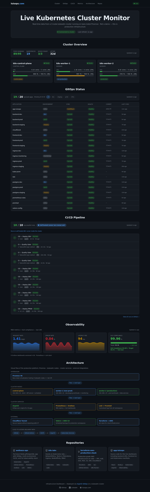
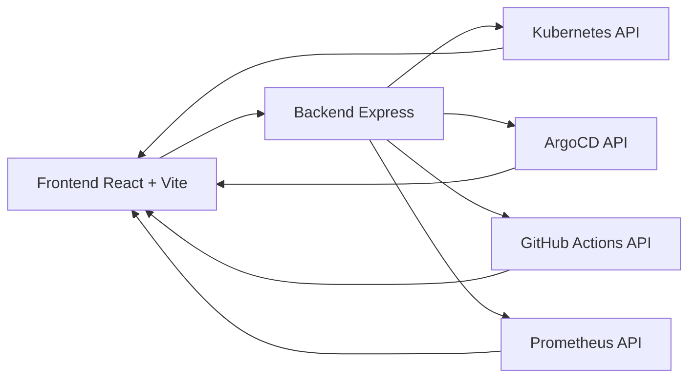

# app-luisops

app-luisops is an operations dashboard for a real Kubernetes platform. It brings together cluster health, GitOps state from ArgoCD, CI/CD activity from GitHub Actions, and observability metrics from Prometheus in a single interface.

The goal is not to display pretty cards. The goal is to give both an executive and technical view of the platform: what is healthy, what is degraded, and where to look first when something breaks.

## What it solves

- Reduces diagnosis time by centralizing cluster, GitOps, CI/CD, and metrics in one panel.
- Lets you verify in seconds whether an application is synced, healthy, or out of sync.
- Surfaces reliability signals with near real-time RED and SLO metrics.
- Works well as a portfolio piece for recruiters: infrastructure, backend, frontend, GitOps, and operational thinking in one project.

## Real screenshots

The images below were captured from the application while it was running with live platform data.

### Overview


### GitOps


### Observability



### Repositories


### Author


## Current system state

The project is designed around a real Kubernetes environment, not mock data. In the current live capture you can see:

- 3 Ready nodes.
- 19 visible namespaces.
- GitOps with 19/20 applications synced.
- One application intentionally marked OutOfSync to reflect real operational state.
- Observability showing live values and series, plus fallback handling when Prometheus is not reachable locally.

The backend also includes request timeouts, per-endpoint caching, and partial responses when an upstream dependency fails, so the UI does not collapse into empty screens or total errors.

## Architecture



The flow is straightforward:

1. The frontend queries the REST backend.
2. The backend aggregates data from Kubernetes, ArgoCD, GitHub, and Prometheus.
3. The frontend renders module-level status with periodic refreshes.

## Technical stack

### Backend

- Node.js + Express 5.
- `@kubernetes/client-node` for cluster data.
- `axios` for external APIs.
- `node-cache` for lower latency and reduced load.

### Frontend

- React 19 + Vite.
- Tailwind CSS v4.
- Recharts for time-series visualizations.

### Platform

- Docker Compose for local execution.
- Kubernetes for deployment.
- ArgoCD for GitOps.
- GitHub Actions for CI/CD.
- Prometheus for observability.

## Dashboard sections

1. Cluster Overview
2. GitOps Status
3. CI/CD Pipeline
4. Observability
5. Architecture
6. Repositories

Each section includes loading and error states plus a last-updated indicator. Refresh intervals are separated by criticality so the UI and backend stay responsive.

## Backend

### Endpoints

- `GET /api/health`
- `GET /api/cluster/nodes`
- `GET /api/cluster/pods`
- `GET /api/cluster/namespaces`
- `GET /api/cluster/health`
- `GET /api/gitops/applications`
- `GET /api/cicd/runs`
- `GET /api/metrics/red`
- `GET /api/metrics/slo`
- `GET /api/metrics/history?hours=24&step=15m`

### Caching policy

- `short`: 30s
- `medium`: 120s
- `long`: 300s
- `extraLong`: 900s

Applied by route:

- `cluster/*`: `short`
- `gitops/applications`: `short`
- `cicd/runs`: `medium`
- `metrics/red` and `metrics/slo`: `long`
- `metrics/history`: `extraLong`

### Integrations

- Kubernetes: nodes, pods, namespaces, health, and metrics when `metrics.k8s.io` is available.
- ArgoCD: authenticated requests with a Bearer token and internal CA verification.
- GitHub Actions: recent runs from the platform repo with status, branch, duration, and trigger.
- Prometheus: instant queries and time-series queries for RED + SLO.

## Environment variables

### Backend

- `PORT` - defaults to `3100`.
- `CORS_ORIGIN` - defaults to `*`.
- `PROMETHEUS_URL` - Prometheus service URL.
- `ARGOCD_API_URL` - ArgoCD API URL.
- `ARGOCD_TOKEN` - access token for ArgoCD.
- `ARGOCD_CA_CERT_PATH` - CA certificate path.

### Frontend

- `VITE_API_URL` - defaults to `http://localhost:3100`.

## Local development

### Requirements

- Node.js 18+.
- npm.
- Cluster access if you want to query a real Kubernetes environment.
- Connectivity to ArgoCD and Prometheus depending on the target setup.

### Backend

```bash
cd backend
npm install
PORT=3100 PROMETHEUS_URL=http://localhost:9090 node src/server.js
```

### Frontend

```bash
cd frontend
npm install
VITE_API_URL=http://localhost:3100 npm run dev -- --host --port 8080
```

### Expected URLs

- Frontend: http://localhost:8080
- Backend: http://localhost:3100

## Docker Compose

To start the full stack with one command:

```bash
docker compose up --build
```

In this mode the frontend is served on `8080` and the backend on `3100`.

## Kubernetes

`k8s/base` contains the minimum RBAC setup needed for read-only platform access:

- Namespace `dashboard`.
- ServiceAccount `dashboard-reader`.
- ClusterRole `dashboard-read-only`.
- ClusterRoleBinding `dashboard-read-only-binding`.

Apply the base manifests with:

```bash
kubectl apply -f k8s/base
```

Main permissions:

- Core API: nodes, pods, namespaces, and services.
- Apps API: deployments, replicasets, and statefulsets.
- `metrics.k8s.io`: nodes and pods.

## Why this project stands out

- It is built like a product, not like a throwaway demo.
- It tolerates partial failures without breaking the whole interface.
- It solves a real operations problem: seeing infrastructure, deployment, and observability health in one place.
- It tells a clear recruiter story: polished frontend, data-aggregating backend, Kubernetes, GitOps, and CI/CD.

## Operational note

The observability section falls back gracefully when Prometheus is not available locally. That avoids a bad user experience and keeps the dashboard usable even when an upstream dependency is degraded.
